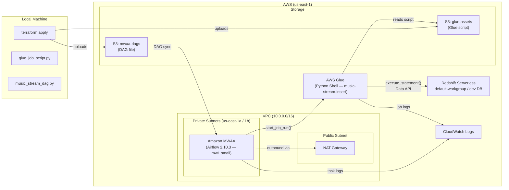
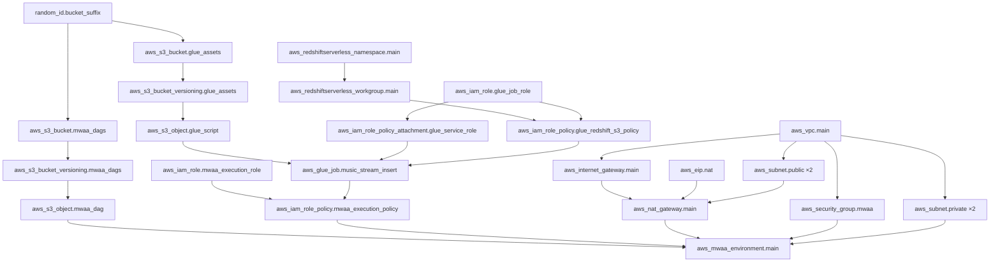
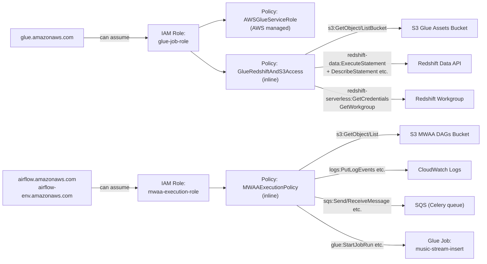

# AWS Learning Architecture — Diagram

## High-Level Data Flow

```mermaid
flowchart LR
    subgraph Local["Local Machine"]
        TF["terraform apply"]
        Script["glue_job_script.py"]
        DAG["music_stream_dag.py"]
    end

    subgraph AWS["AWS (us-east-1)"]
        subgraph VPC["VPC (10.0.0.0/16)"]
            subgraph Private["Private Subnets (us-east-1a / 1b)"]
                MWAA["Amazon MWAA\n(Airflow 2.10.3 — mw1.small)"]
            end
            subgraph Public["Public Subnet"]
                NAT["NAT Gateway"]
            end
        end

        subgraph Storage["Storage"]
            S3G["S3: glue-assets\n(Glue script)"]
            S3M["S3: mwaa-dags\n(DAG file)"]
        end

        Glue["AWS Glue\n(Python Shell — music-stream-insert)"]
        Redshift["Redshift Serverless\ndefault-workgroup / dev DB"]
        CW["CloudWatch Logs"]
    end

    TF -->|"uploads"| S3G
    TF -->|"uploads"| S3M
    S3M -->|"DAG sync"| MWAA
    MWAA -->|"outbound via"| NAT
    MWAA -->|"start_job_run()"| Glue
    Glue -->|"reads script"| S3G
    Glue -->|"execute_statement()\nData API"| Redshift
    MWAA -->|"task logs"| CW
    Glue -->|"job logs"| CW
```

## Terraform Dependency Graph

```mermaid
flowchart TD
    A["random_id.bucket_suffix"]
    B["aws_vpc.main"]
    C["aws_eip.nat"]

    A --> D["aws_s3_bucket.glue_assets"]
    A --> E["aws_s3_bucket.mwaa_dags"]

    B --> F["aws_subnet.private ×2"]
    B --> G["aws_subnet.public ×2"]
    B --> H["aws_internet_gateway.main"]
    B --> SG["aws_security_group.mwaa"]

    H --> I["aws_nat_gateway.main"]
    C --> I
    G --> I

    D --> J["aws_s3_bucket_versioning.glue_assets"]
    J --> M["aws_s3_object.glue_script"]

    E --> N["aws_s3_bucket_versioning.mwaa_dags"]
    N --> O["aws_s3_object.mwaa_dag"]

    RS1["aws_redshiftserverless_namespace.main"] --> RS2["aws_redshiftserverless_workgroup.main"]

    ROLE1["aws_iam_role.glue_job_role"] --> POL1["aws_iam_role_policy_attachment.glue_service_role"]
    RS2 --> POL2["aws_iam_role_policy.glue_redshift_s3_policy"]
    ROLE1 --> POL2

    M --> GLUE["aws_glue_job.music_stream_insert"]
    POL1 --> GLUE
    POL2 --> GLUE

    ROLE2["aws_iam_role.mwaa_execution_role"] --> MPOL["aws_iam_role_policy.mwaa_execution_policy"]
    GLUE --> MPOL

    O --> MWAA["aws_mwaa_environment.main"]
    MPOL --> MWAA
    I --> MWAA
    SG --> MWAA
    F --> MWAA
```

## IAM Trust Relationships

```mermaid
flowchart LR
    GlueSvc["glue.amazonaws.com"]
    GlueRole["IAM Role:\nglue-job-role"]
    GluePol1["Policy: AWSGlueServiceRole\n(AWS managed)"]
    GluePol2["Policy: GlueRedshiftAndS3Access\n(inline)"]

    GlueSvc -->|"can assume"| GlueRole
    GlueRole --> GluePol1
    GlueRole --> GluePol2

    GluePol2 -->|"s3:GetObject/ListBucket"| S3Glue["S3 Glue Assets Bucket"]
    GluePol2 -->|"redshift-data:ExecuteStatement\n+ DescribeStatement etc."| RSAPI["Redshift Data API"]
    GluePol2 -->|"redshift-serverless:GetCredentials\nGetWorkgroup"| RSWorkgroup["Redshift Workgroup"]

    MWAASvc["airflow.amazonaws.com\nairflow-env.amazonaws.com"]
    MWAARole["IAM Role:\nmwaa-execution-role"]
    MWAAPol["Policy: MWAAExecutionPolicy\n(inline)"]

    MWAASvc -->|"can assume"| MWAARole
    MWAARole --> MWAAPol

    MWAAPol -->|"s3:GetObject/List"| S3DAGs["S3 MWAA DAGs Bucket"]
    MWAAPol -->|"logs:PutLogEvents etc."| CW["CloudWatch Logs"]
    MWAAPol -->|"sqs:Send/ReceiveMessage etc."| SQS["SQS (Celery queue)"]
    MWAAPol -->|"glue:StartJobRun etc."| GlueJob["Glue Job:\nmusic-stream-insert"]
```
